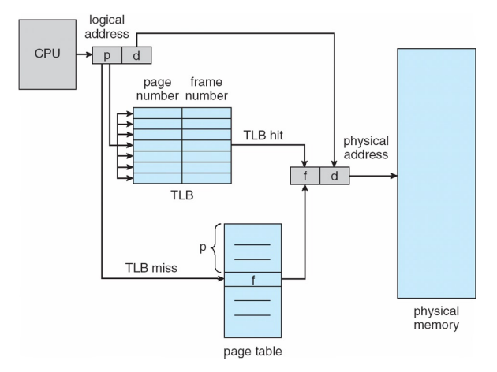

# 면접 기출 예시

## 개념 질문

### 1. Demand paging이란 무엇인가? (P 23-24 First)
~~~
프로그램이 실제로 필요로 할 때(요구할 때)에만 해당 페이지를 메모리에 불러오는 방식
즉, 프로그램의 전체 페이지를 한꺼번에 메모리에 올리지 않고, 실제로 접근하는 페이지만 로딩하는 것
~~~

### 2. 요구 페이징(demand-paging)에서 페이지 폴트(page fault)는 어떤 상황에서 발생하는가? 페이지 폴트가 발생했을 때 운영체제가 수행하는 동작들을 설명하시오. (P 24-25 Second)
✅ Page Fault 발생 조건:  
~~~
프로세스가 접근하려는 페이지가 현재 메모리에 없는 경우 (즉, 디스크에 존재)
~~~

✅ Page Fault 발생 시 OS 동작:  
~~~
1. Page Fault Exception 처리 => OS로 제어권 넘김
2. 해당 Page가 디스크에 있는지 확인
3. Frame 확보 (필요시 Page 교체)
4. 디스크에서 메모리로 Page 로드
5. Page Table 업데이트
6. 중단된 명령어 재실행
~~~

### 3. TLB(Translation Lookaside Buffer)란 무엇인가? TLB의 역할과 동작 방식에 대해 명확히 설명하시오. (P 24-25 First)
✅ TLB란 무엇인가?  
~~~
가상 주소 => 물리 주소 변환을 빠르게 하기 위한 Cache 메모리
(MMU에 내장됨)
~~~

✅ 역할 및 기능:  
~~~
자주 참조되는 Page Table Entry를 캐싱하여
Page Table에 접근할 필요가 없게끔 하고,
Address Translation 속도를 향상시키는 역할

TLB hit가 발생하면 빠른 변환이 이루어짐
TLB miss가 발생하면 Page Table 접근하여 TLB에 항목 추가를 고려
~~~

### 4. TLB 슛다운(TLB shootdown)이란 무엇인가? 그것이 왜 (또는 언제) 필요한지 설명하시오. (P 24-25 First)
✅ TLB Shootdown이란?  
~~~
멀티코어 환경에서 주소 매핑 일관성을 유지하기 위한
TLB 무효화 작업 (각 코어의 TLB 항목 무효화)
~~~

✅ 언제 왜 필요한가?  
~~~
여러 코어(쓰레드)에서 공유되는 Page Table이 변경될 때,
TLB는 각 코어마다 따로 존재하고, 
Page Table이 변경되면 TLB에 캐시된 내용과 불일치 문제가 발생 가능함

따라서, 일관성을 유지하기 위해 필요함
~~~

### 5. Copy-on-Write는 무엇인가? 사용했을 때의 이점은 무엇인가?
~~~
~~~

## Address Translation 심층 문제
### 1. Consider a logical address space of eight pages of 1024 words each, mapped onto a physical memory of 32 frames. How many bits are there in the logical address and the physical address? (P 24-25 Second)
~~~
각각 1024 바이트 (2^10) 크기의 Page
Virtual Memory의 8개 Page를
Physical memory의 32개 Frame에 매핑

Virtual Address: 13 bits
Page offset으로 10 bits 사용
Virtual Page Number로 3 bits 사용

Physical Address: 15 bits
Frame offset으로 10 bits 사용
Physical Frame Number로 5 bits 사용
~~~

-----

### 2. A certain computer provides its users with a virtual-memory space of 2^32 bytes. The computer has 2^18 bytes of physical memory. The virtual memory is implemented by paging, and the page size is 4096 bytes (where 4096 = 2^12). A user process generates the virtual address 11123456 (that is, 0001 0001 0001 0010 0011 0100 0101 0110 in binary format). Explain how the system computes the corresponding physical location. (P 23-24 Second)

1️⃣ Step 1. Virtual Address, Physical Address 필드 해석
~~~
Page 하나의 크기는 2^12 bytes 이므로, 12 bits는 Page Offset으로 사용된다.
따라서, 주어진 Virtual Address의 456 ("0100 0101 0110") 부분이 Page Offset이다.
그리고 나머지 11123 ("0001 0001 0001 0010 0011") 부분이 Virtual Page Number이다.

Physical Memory의 크기는 2^18 bytes이므로, Physical Address는 총 18 bits로 이루어지며,
이 중, 12 bits는 Frame Offset로 사용되고,
나머지 6 bits는 Physical Frame Number로 사용된다.
~~~

2️⃣ Step 2. Page Table: Virtual Page Number → Physical Frame Number
~~~
이 부분은 시스템에 저장된 Page Table에 따라 달라짐
→ 즉, 실제 VPN 0x11123이 어떤 Physical Frame Number(PFN)에 매핑되는지는 Page Table이 필요함
~~~

3️⃣ Step 3. PFN을 찾은 이후, 변환된 Physical Address
~~~
Page Table에서 VPN에 해당하는 PFN이 0x15("00010101")라고 가정한다면,

PFN 상위 6 bits와 Offset 12 bits를 합친 것이 Physical Address가 됨
"0001 01" + "0100 0101 0110" → "000101010001010110"
~~~

-----

### 3. For a processor with 64-bit virtual addresses, a single-level page table, a 34-bit physical address space, and 64KB pages, show a diagram depicting how a virtual address is translated into a physical address. Make sure to label each field and path with a name and the number of bits, and include the TLB and page table in your diagram (Assume no page faults). (P 22-23 First)
1️⃣ Step 1. Virtual Address, Physical Address 필드 해석
~~~
Virtual Address 해석:
Page 하나의 크기가 64KB = 2^16 bytes이므로, 
    Page Offset은 16 bits
Virtual Address(64 bits)에서 Page Offset(16 bits)를 제외한
    Virtual Page Number는 48 bits

Physical Address 해석:
Offset 크기는 VA의 Page Offset의 크기와 같으므로,
    Frame Offset은 16bits
Physical Address(34 bits)에서 Frame Offset(16 bits)를 제외한
    Physical Frame Number는 18 bits
~~~
2️⃣ Step 2. TLB (hit일 경우): Virtual Page Number → Physical Frame Number
~~~
TLB를 탐색하여 대상 VPN(48 bits)이 등록되어 있으면,
48비트 VPN을 받아 18 bits PFN을 반환함
반환된 PFN과 Page Offset을 합쳐서 최종 Physical Address가 만들어짐

이제 완성된 Physical Address로 물리 메모리의 데이터에 접근 가능
~~~

2️⃣ Step 3. TLB (miss일 경우): Page Table 접근
~~~
TLB를 탐색하여 대상 VPN이 등록되지 않았다면,
Page Table에 접근하여 Physical Frame Number을 얻고자 함
~~~

✅ 다이어그램  

## Performance 심층 문제

### 3. Consider a virtual memory system with paging. Assume there is no cache. A memory access is done by a page table lookup followed by an access to the target physical memory address. Now the system provides hardware support with translation look-aside buffers (TLBs) to accelerate the page table lookup time upon a TLB hit. Assume that it takes 20 nanoseconds to search the TLBs, and 100 nanoseconds to access from the main memory. (P 22-23 Second)

### 3.1. With 80% hit ratio of TLBs, calculate the average memory access time.  

AMAT = `TLB hit ratio x (TLB search time + Memory access time)` + `TLB miss ratio x (TLB search time + 2 x Memory access time)`
~~~
AMAT = 0.8 x (20 + 100) + 0.2 x (20 + 200) = 0.8 x 120 + 0.2 x 220 = 96 + 44 = 140 ns
~~~
### 3.2. With 98% hit ratio of TLBs, calculate the average memory access time.  
~~~
AMAT = 0.98 x (20 + 100) + 0.02 x (20 + 200) = 0.98 x 120 + 0.02 x 220 = 122 ns
~~~

## Page Replacement 심층 문제

### 1. Assume that there are five frames, and all frames are initially empty. For each of the following page replacement algorithms, how many page faults would occur? Consider the following page reference string: (P 22-23 Second)
~~~
1,2,3,4,2,1,5,6,2,1,2,3,7,6,3,6
~~~

#### 1.1. LRU replacement algorithm

#### 1.2. Optimal replacement algorithm

-----

### 2. How many page faults would occur for the following replacement algorithms, assuming one, four, or seven frames? Remember all frames are initially empty, so your first unique pages will all cost one fault each. Consider the following page reference string: (P 22-23 First)
~~~
1,2,3,4,2,1,5,6,2,1,2,3,7,6,3,2
~~~

#### 2.1. LRU replacement

**Assuming four frames:**  
| 순서  | 사용 Page | 교체 대상 | Frame 상태    | Page Fault 발생 여부 |
|-------|-----------|-----------|-------------|---------------------|
| 1     | 1         |           | 1           | O                   |
| 2     | 2         |           | 1,2         | O                   |
| 3     | 3         |           | 1,2,3       | O                   |
| 4     | 4         |           | 1,2,3,4     | O                   |
| 5     | 2         |           | 1,2,3,4     | X                   |
| 6     | 1         |           | 1,2,3,4     | X                   |
| 7     | 5         | 3         | 1,2,5,4     | O                   |
| 8     | 6         | 4         | 1,2,5,6     | O                   |
| 9     | 2         |           | 1,2,5,6     | X                   |
| 10    | 1         |           | 1,2,5,6     | X                   |
| 11    | 2         |           | 1,2,5,6     | X                   |
| 12    | 3         | 5         | 1,2,3,6     | O                   |
| 13    | 7         | 6         | 1,2,3,7     | O                   |
| 14    | 6         | 1         | 6,2,3,7     | O                   |
| 15    | 3         |           | 6,2,3,7     | X                   |
| 16    | 2         |           | 6,2,3,7     | X                   |

🎯 Page Fault `9번` 발생

#### 2.2. FIFO replacement

**Assuming four frames:**  
| 순서  | 사용 Page | 교체 대상 | Frame 상태    | Page Fault 발생 여부 |
|-------|-----------|-----------|-------------|---------------------|
| 1     | 1         |           | 1           | O                   |
| 2     | 2         |           | 1,2         | O                   |
| 3     | 3         |           | 1,2,3       | O                   |
| 4     | 4         |           | 1,2,3,4     | O                   |
| 5     | 2         |           | 1,2,3,4     | X                   |
| 6     | 1         |           | 1,2,3,4     | X                   |
| 7     | 5         | 1         | 5,2,3,4     | O                   |
| 8     | 6         | 2         | 5,6,3,4     | O                   |
| 9     | 2         | 3         | 5,6,2,4     | O                   |
| 10    | 1         | 4         | 5,6,2,1     | O                   |
| 11    | 2         |           | 5,6,2,1     | X                   |
| 12    | 3         | 5         | 3,6,2,1     | X                   |
| 13    | 7         | 6         | 3,7,2,1     | O                   |
| 14    | 6         | 2         | 3,7,6,1     | O                   |
| 15    | 3         |           | 3,7,6,1     | X                   |
| 16    | 2         | 1         | 3,7,6,2     | O                   |

🎯 Page Fault `11번` 발생

#### 2.3. Optimal replacement

**Assuming four frames:**  
| 순서  | 사용 Page | 교체 대상 | Frame 상태    | Page Fault 발생 여부 |
|-------|-----------|-----------|-------------|---------------------|
| 1     | 1         |           | 1           | O                   |
| 2     | 2         |           | 1,2         | O                   |
| 3     | 3         |           | 1,2,3       | O                   |
| 4     | 4         |           | 1,2,3,4     | O                   |
| 5     | 2         |           | 1,2,3,4     | X                   |
| 6     | 1         |           | 1,2,3,4     | X                   |
| 7     | 5         | 4         | 1,2,3,5     | O                   |
| 8     | 6         | 5         | 1,2,3,6     | O                   |
| 9     | 2         |           | 1,2,3,6     | X                   |
| 10    | 1         |           | 1,2,3,6     | X                   |
| 11    | 2         |           | 1,2,3,6     | X                   |
| 12    | 3         |           | 1,2,3,6     | X                   |
| 13    | 7         | 1         | 7,2,3,6     | O                   |
| 14    | 6         |           | 7,2,3,6     | X                   |
| 15    | 3         |           | 7,2,3,6     | X                   |
| 16    | 2         |           | 7,2,3,6     | X                   |

🎯 Page Fault `7번` 발생

-----

### 3. How does DMA (Direct Memory Access) increase system concurrency? How does it complicate hardware design? (P 22-23 First)

