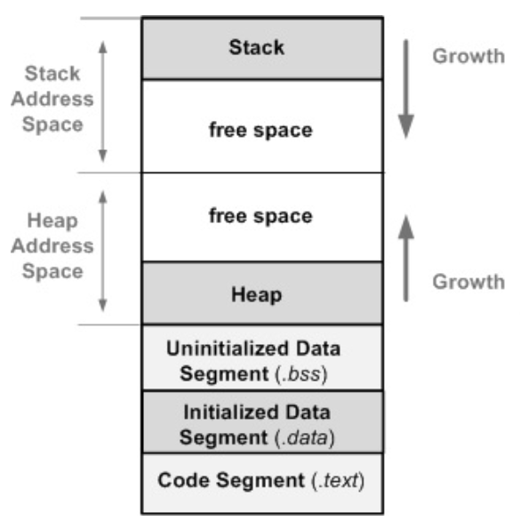

# 자주 등장한 문제
## Chapter 3. Process
### Q: Process와 Thread의 주요 차이를 설명하시오. 
~~~
1. 생성/전환 비용:
    프로세스는 생성/전환 비용이 큼
    쓰레드는 생성/전환 비용이 작음

2. 메모리 영역의 독립성:
    프로세스는 자신만의 독립된 메모리 공간을 가져 완전히 분리되어 있음
    쓰레드는 Code, Data, Heap 영역을 공유하며, Stack은 쓰레드마다 개별적으로 따로 존재함
~~~

## Chapter 5. Process Synchronization
### Q: 두 Kernel 쓰레드 사이의 컨택스트 스위칭과 두 User 프로세스 사이의 컨택스트 스위칭의 오버헤드를 비교하시오.
~~~
쓰레드 간의 context switching은 프로세스 간의 context switching보다 오버헤드가 적다.
~~~
✅ **이유:**  
1. **주소 공간 공유**
    * 쓰레드 간: 주소 공간을 **공유**함
    * 프로세스 간: **독립된** 주소 공간 (**Page Table 변경, TLB flush** 등을 해야 함)

2. **커널 개입 정도**
    * 쓰레드 간: 커널 개입이 훨씬 적음 (**레지스터, PC, Stack Pointer 같은 최소 상태만** 저장/복원)
    * 프로세스 간: 커널 개입이 많음 (Page Table 변경, TLB flush 등) 

3. **캐시 영향**
    * 쓰레드 간: **같은 주소 공간**을 사용하므로 **캐시 Hit율**이 높음
    * 프로세스 간: 주소 공간이 달라 **캐시와 TLB 무효화(Flush) 발생**

## Chapter 7. Deadlocks
### Q: Deadlock가 발생하기 위한 4가지 필요 조건들을 제시하시오. 각 조건을 정확히 설명하시오.
~~~
1. 상호 배제 (Mutual Exclusion) 조건:
    자원은 한 번에 하나의 프로세스만 사용할 수 있어야 함

2. 점유와 대기 (Hold and Wait) 조건:
    프로세스가 어떤 자원을 점유한 상태에서 다른 자원을 요청하며 대기하여야 함

3. 비선점(Non Preemptation) 조건
    할당된 자원을 강제로 뺏을 수 없으며,
    프로세스가 자원을 반납해야 함

4. 순환 대기 (Circular Wait) 조건
    서로의 자원을 기다리며 원형으로 대기하는 상황이어야 함
~~~

# 등장하지 않았지만 중요한 개념

## Chapter 3. Process
### Q: Stack Pointer란 무엇인가? SP와 PC의 차이를 설명하시오.
📌 **Stack Pointer란?**  
~~~
SP(Stack Pointer)는 스택의 마지막 프로그램 요청 주소를 저장하는 레지스터임
~~~
✅ **SP(Stack Pointer) vs. PC(Program Counter)**
~~~
SP는 스택의 마지막 프로그램 요청 주소를 보유하는 반면, 
PC는 실행되어야 할 다음 명령어의 주소를 보유함
~~~

## Chapter 5. Process Synchronization
### Q: 프로세스의 컨텍스트(context)란 무엇이며, 컨텍스트 스위칭(context switching)에서 수행되는 주요 단계들은 무엇인가?
📌 **Context란?**  
~~~
context는 프로세스가 실행되던 상태의 정보들을 의미하며,
잠시 중단되었을 때, 실행 상태를 복구하여 이어서 실행이 가능하도록 함

포함되는 정보:
실행될 때의 프로세서 레지스터 값들, 프로세스 상태, 메모리 정보(Page Table), CPU 정보(우선순위, 스케줄링 정보)
~~~

✅ Context Switching 과정:  
~~~
1. 현재 프로세스의 context를 PCB에 저장
2. 다음에 실행할 프로세스의 context를 PCB에서 읽어서 복원
3. 메모리 세팅: 프로세스에 필요한 Page나 Segment를 메모리에 준비
4. CPU 제어 전환: PC를 새 프로세스 위치로 이동하여 실행
~~~

-----

### Q: Dispatcher란 무엇인가?
~~~
Dispatcher는 Context Switching을 담당하는 OS 구성요소

아래의 기능들을 수행함
1. 문맥 교환 (Context Switch)
2. 사용자 모드로 전환: Kernel 모드 → User 모드로 전환
3. 프로세스의 프로그램 카운터(PC)를 적절히 설정: 새 프로세스가 실행을 이어가도록 함
~~~

-----

### Q: Critical Section이란 무엇인가?
~~~
둘 이상의 쓰레드가 접근해서는 안되는 공유 자원에 접근하는
코드의 일부 영역을 가리킴
~~~

## Chapter 7. Deadlocks
Deadlock Avoidance - 뱅커 알고리즘 문제  

## Chapter 8. Memory Management Strategies
### Q: Segmentation, Paging의 차이점과 장단점을 설명하시오.
📌 Segmentation 개념  
~~~
프로그램을 논리적인 단위(Segment)로 나누어 메모리를 관리하는 방식
예: 코드 영역, 데이터 영역, 스택 등
~~~

📌 Paging 개념  
~~~
가상 주소 공간과 물리 주소 공간을 고정 크기 페이지(Page)로 나누어 관리하는 방식
~~~

🎯 Segmentation과 Paging의 차이점  
~~~
Segmentation은 가변 크기의 Segmentation 단위로 나누지만, Paging은 고정 크기의 Page 단위로 나눔
~~~

🎯 **Segmentation**의 **장단점**  
~~~
✅ 장점:
    1. 내부 단편화가 없음
    2. Dynamic relocation이 가능함 (실행 중에도 Segment의 위치 이동 가능)

❌ 단점:
    1. 외부 단편화가 있음
    2. Segment의 모든 메모리를 사용하지 않을 수 있음 (e.g., Heap)
~~~

🎯 **Paging**의 **장단점**  
~~~
✅ 장점:
    1. 내부 단편화가 없음
    2. 할당과 해제가 빠름
	3. Swapping이 쉬움

❌ 단점 
    1. 내부 단편화: Page Size가 커질수록 내부 단편화가 심해짐
    2. Page Table을 위한 추가적인 메모리 공간이 필요함
    3. Page를 찾기 위해 추가적인 메모리 접근이 필요함
~~~

-----

### Q: 외부 단편화, 내부 단편화란 무엇인지 설명하시오.

🎯 외부 단편화 (External Fragmentation)  
~~~
작고 흩어진 빈 공간(조각)들이 많이 생겨서,
총 유효한 여유 공간은 충분하지만,
연속된 큰 공간이 없어서 큰 프로세스를 수용할 수 없는 현상
~~~

🎯 내부 단편화 (Internal Fragmentation)  
~~~
프로세스에 할당된 메모리 블록(조각) 내에서
실제 사용하지 않고 낭비되는 공간이 내부에 존재하는 현상
~~~

-----

### Q: 페이지 크기가 클수록 Page Table 크기와 내부 단편화 문제는 어떻게 바뀌는지 설명하시오.

* 페이지 크기가 클수록
    * Page Table 크기는 커지고,
    * 내부 단편화 문제는 심해짐

### Q: 메모리 Segment 구성 요소들과 용도를 설명하시오.

**메모리 세그먼트 구성 표:**  
| 세그먼트            | 설명                                   | 주요 용도                                   | 읽기/쓰기       | 크기 변화      |
|---------------------|----------------------------------------|----------------------------------------------|------------------|-----------------|
| **Text Segment**    | 실행할 기계어 코드(명령어) 저장         | 프로그램 실행 코드                            | 읽기 전용 (RO)   | 고정             |
| **Data Segment**    | 초기값이 있는 전역/정적 변수 저장       | `int x = 5;` 등 초기화된 전역/static 변수     | 읽기/쓰기        | 고정             |
| **BSS Segment**     | 초기값이 없는 전역/정적 변수 저장       | `int x;` 등 초기화되지 않은 전역/static 변수 | 읽기/쓰기        | 고정             |
| **Heap**            | 런타임 동적 메모리 할당 공간            | `malloc`, `new` 등으로 할당된 메모리         | 읽기/쓰기        | 위쪽으로 증가     |
| **Stack**           | 함수 호출 시 지역 변수, 리턴 주소 저장  | 지역 변수, 함수 호출 정보 저장               | 읽기/쓰기        | 아래쪽으로 감소   |

**메모리 Segment 그림(아래부터 Low Address):**  

## Chapter 10. File System
### Q: inode란 무엇이며, 어떤 정보를 담고 있는가?
📌 **inode란?**  
~~~
파일을 식별하고 관리하기 위해 사용하는 데이터 구조
즉, 파일의 메타데이터를 담는 구조체

담는 정보:
    파일 타입, 권한, 소유자, 크기, 시간 정보, 데이터 위치 등
담지 않는 정보: 
    ❌ 파일 이름 (dentry 디렉터리 엔트리가 따로 관리)
~~~

-----

### Q: 파일시스템에서 디렉토리는 어떤 역할을 하는가?
~~~
파일 이름 → inode 번호 매핑의 역할을 함
~~~

-----

### Q: 파일시스템 캐시(Page/Buffer Cache)의 역할은 무엇인가?
~~~
Page/Buffer Cache는 디스크 접근 속도를 줄이기 위해 최근 접근한 데이터를 메모리에 저장해두는 캐시
~~~

-----

### Q: Mount란 무엇이며, 언제 사용되는가?
~~~
Mount는 외부 저장장치나 파일시스템을 운영체제의 디렉토리 트리에 연결하는 작업

부팅시, USB/외장 하드 연결시 Mount함
~~~

-----

### Q: VFS란 무엇이며, 왜 필요한가?
📌 **VFS 개념:**  
~~~
다양한 종류의 실제 파일시스템(ext4, FAT, NTFS 등)을 하나의 공통 인터페이스로 추상화한 계층
~~~

✅ **VFS가 필요한 이유:**
~~~
운영체제는 VFS를 통해 파일시스템의 구체적인 구현과 무관하게 파일을 접근할 수 있으며,
이로 인해 다양한 파일시스템을 동시에 사용하거나 마운트할 수 있게 됨
~~~

-----

### Q: VFS와 실제 파일시스템(ext4, FAT 등) 간의 관계를 설명하시오.
~~~
VFS는 파일, 디렉토리, inode 등의 추상 구조를 제공하며,
각 실제 파일시스템은 VFS가 정의한 인터페이스에 연결됨

운영체제는 VFS 계층만 호출하고, 실제 처리 방식은 각 파일시스템 모듈이 처리함
~~~

-----

### Q: VFS의 주요 역할 또는 기능을 2가지 이상 설명하시오.
~~~
1. 파일시스템 추상화: 다양한 파일시스템(ext4, FAT, NTFS 등)을 동일한 인터페이스로 다룰 수 있게 함

2. 동시 사용 지원: 여러 파일시스템을 하나의 디렉토리 트리 내에 마운트하여 통합된 구조로 제공

3. 파일 캐싱 및 핸들 관리: 파일 디스크립터, 파일 테이블 등 공통 자원 관리
~~~

-----

### Q: VFS 구조에서 inode, dentry, superblock은 어떤 역할을 하는가?
~~~
inode: 파일의 메타데이터(크기, 권한, 데이터 블록 위치 등)를 나타냄

dentry (directory entry): 파일 이름 ↔ inode 매핑을 관리

superblock: 파일시스템 전체의 정보(크기, 블록 수, 파일시스템 타입 등)를 저장
~~~
